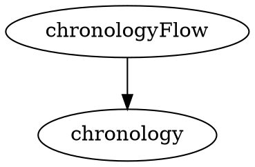

# Хронология — шаг 1: каркас, токены, полотно, первый узел

> **Статус: шаг выполнен и влит в `dev`.** Двенадцать коммитов, 27 юнит-тестов на геометрию,
> раскладку и телеметрию. Полотно панорамируется, узлы стоят по паузам, связи рисуются, есть
> отладочная панель под тоглом `chronologyDebugOverlay`.
>
> Часть решений этого плана реализация **изменила** — см. раздел «Как вышло иначе» в конце.
> Полный журнал итераций и устоявшиеся решения — в [chronology-log.md](chronology-log.md).
> Код-скетчи ниже оставлены как исторические: они описывают замысел до ревью, а не то, что в `dev`.

## Context

Дизайн готов и лежит вне репозитория: `~/Desktop/main/` — 20 макетов фичи, `~/Desktop/components/` —
каталог из 39 компонентов с геометрией в dp, таблицами параметров и ролей токенов. Бриф, по которому
он сделан, — [chronology-design-prompt.md](docs/plans/chronology-design-prompt.md) (§-ссылки в
дизайне указывают на него). Общая архитектура фичи разобрана там же в §17 и в предыдущей версии
этого плана.

Фича целиком — это модуль из четырёх подмодулей, новая система координат, `Path`-рисование, жесты
пана и зума, три уровня детализации, церемония слияния. Для одного ревью это неподъёмно.

Этот документ — **только первый атомарный шаг**: после него разработчик проводит ревью и даёт добро
на следующий. Ничего сверх перечисленного в шаг не входит.

**Решения, зафиксированные с постановщиком:**

1. Токены заводятся **одним куском** — цвета, типографика и motion вместе.
2. Полотно — **координаты, фон и пан**. Зума и переключения LOD в этом шаге нет.
3. Данные — **мок в `ViewModel`**. `data` создаётся как каркас с заглушкой репозитория; подключение
   реальных источников (новый запрос в `ChatCommit.sq`, сборка графа) — отдельный шаг.
4. Цвета дорожек получены от постановщика (см. ниже).

---

## 1. Каркас модуля и навигация

### Новые gradle-модули

Четыре строки в [settings.gradle](settings.gradle) рядом с блоком `chat-branch`:

```
include ':feature:chronology:data'
include ':feature:chronology:domain'
include ':feature:chronology:routing'
include ':feature:chronology:ui'
```

Build-файлы — Groovy `build.gradle` (в проекте нет ни одного `.kts`), дословный шаблон —
`feature/chat-branch/*/build.gradle`. Плагины по слоям: `domain` → `kotlin-convention` +
`kotlin-inject-convention`; `data` → `android-library-convention` + `kotlin-inject-convention`;
`ui` → `+ android-compose-convention`; `routing` → то же `+ alias(libs.plugins.way)`.
Пакеты — `ru.sla.clarify.feature.chronology.{domain,data,ui,routing}`. В каждом модуле `.gitignore`
с одной строкой `/build`.

### domain

- `di/ChronologyScope.kt` — пустой маркер-интерфейс. Собственный скоуп, как у каждого флоу.
- `entity/TargetParams.kt` — `data class TargetParams(val peerId: Peer.Id)`. Тот же параметр, что у
  direct-thread: беседа резолвится из собеседника, отдельный `conversationId` не нужен.
- `ChronologyRepository.kt` — интерфейс с одним потоком веток. Наполняется на следующем шаге.

### data

`ChronologyRepositoryImpl` с `@SingleIn(ChronologyScope::class) @ContributesBinding(ChronologyScope::class)`,
возвращающий пустой поток. Это осознанная заглушка: модуль и его DI-привязка создаются сейчас, чтобы
проверить gradle- и DI-обвязку одним ревью, а не дважды.

### routing

`src/main/way/chronology_flow.dot` — маршрут описывается graphviz-файлом, из него плагин генерирует
схему, билдер, таргеты и `ChildFinishRequest`:



Плюс четыре файла по дословному образцу `feature/chat-branch/routing/`:
`ChronologyFlow.kt`, `ChronologyFlowNode.kt` (`BaseFlowNode<Unit>`, `initial =
Target.chronologyFlow.chronology`, единственный переход `FlowEvent.ChronologyDismissed → Finish(Unit)`,
в `init` — `FlowNodeScopeDisposalHook`), `di/ChronologyFlowComponent.kt`
(`@ContributesSubcomponent(ChronologyScope::class)` с вложенной
`@ContributesSubcomponent.Factory(DirectThreadScope::class)`; `CoroutineScope` создаётся через
`createCoroutineScope` от `@ForScope(DirectThreadScope::class)`), `di/ChronologyFlowNodeFactory.kt`.

### ui

- `screen/chronology/{ViewState, ViewIntents, ChronologyViewModel, ChronologyScreen}.kt`.
  `ViewEvents` в этом шаге не нужен — снекбаров и диалогов ещё нет.
- `di/ChronologyUiModule.kt` — `@ContributesTo(ChronologyScope::class)` с `WiredComposableScreen.bind`.
- `routing/FlowEvent.kt` — `data object ChronologyDismissed`.

`ChronologyScreen` на этом шаге — `ScreenScaffold` с полотном (раздел 3) и текстом-заглушкой поверх,
чтобы по экрану было видно, что открылся нужный флоу.

### Точка входа из чата

Пять точек подключения дочернего флоу — ровно те, что уже проделаны для `branchFlow`:

1. [direct_thread_flow.dot](feature/chat-direct-thread/routing/src/main/way/direct_thread_flow.dot) —
   узел `chronologyFlow [type = "schema", ...]` и ребро `directThread -> chronologyFlow`.
2. [DirectThreadFlow.kt](feature/chat-direct-thread/routing/src/main/kotlin/ru/sla/clarify/feature/chat/direct/thread/routing/DirectThreadFlow.kt) —
   аргумент `chronologyFlowSchema = ChronologyFlow.schema`.
3. [DirectThreadFlowNode.kt:36](feature/chat-direct-thread/routing/src/main/kotlin/ru/sla/clarify/feature/chat/direct/thread/routing/DirectThreadFlowNode.kt:36) —
   ветки `FlowEvent.ChronologyRequested → NavigateTo(...)` и
   `DirectThreadFlowChildFinishRequest.ChronologyFlow → NavigateTo(directThread)`. `else -> Ignore`
   уже есть, `when` останется корректным.
4. `DirectThreadFlowNodeFactory.kt` — `createChronologyFlowNodeBuilder(params)` через каст компонента
   к `ChronologyFlowComponent.Factory`.
5. `feature/chat-direct-thread/routing/build.gradle` — `api project(":feature:chronology:routing")`.

Плюс в ui-слое direct-thread:
- [FlowEvent.kt](feature/chat-direct-thread/ui/src/main/kotlin/ru/sla/clarify/feature/chat/direct/thread/ui/routing/FlowEvent.kt) —
  `data object ChronologyRequested`.
- `ViewIntents` + `DirectThreadViewModel` — интент `openChronology`, отправляющий этот `FlowEvent`
  через `eventSink`.
- [DirectThreadScreen.kt:173](feature/chat-direct-thread/ui/src/main/kotlin/ru/sla/clarify/feature/chat/direct/thread/ui/screen/thread/DirectThreadScreen.kt:173) —
  в `actions` рядом с существующим чипом счётчика веток добавляется `IconAction` с
  `R.drawable.ic_git_network_24` (иконка уже есть в `core/resources`).

**Выбор варианта входа (§18.13 дизайна — открыт) в этом шаге не делается.** Кнопка-заглушка — самый
простой `IconAction`; вариант А (иконка + отдельный чип) против Б (один чип «Ветки · N») решается
позже, вместе с макетом на самое длинное реальное имя собеседника.

### Строки

`core/resources/src/main/res/values/strings.xml` и `values-ru/strings.xml` — секция
`<!-- Chronology screen -->`, ключи с префиксом `chronology_`. Своих `strings.xml` у фич не бывает.

---

## 2. Токены

Новые цвета не заводятся сырыми хексами в компонентах: палитра закрыта (`internal object
ColorPalette` с явным запретом в комментарии), компоненты работают только с ролями `AppColors`.

### [ColorPalette.kt](uikit/src/main/kotlin/ru/sla/clarify/uikit/theme/ColorPalette.kt)

Шесть оттенков идентичности дорожки — вне семантики (зелёный, золотой, фиолетовый и красный уже
заняты статусами):

| Запись | Hex | Имя в дизайне |
|---|---|---|
| `cyan200` | `#05C2CE` | cyan — **уже есть**, новую запись не заводить |
| `blue200` | `#3B7DE8` | blue |
| `teal200` | `#1AA39A` | teal |
| `magenta200` | `#C74B93` | magenta |
| `terracotta200` | `#B4713E` | terracotta |
| `slate200` | `#7A8CA0` | slate |
| `purple250` | `#BE9BFF` | осветлённый акцент для тёмной темы |

`cyan200` уже существует и равен cyan из дизайна — дубликат хекса в палитре заводить нельзя, роль
`graphLane1` ссылается на существующую запись.

### [AppColors.kt](uikit/src/main/kotlin/ru/sla/clarify/uikit/theme/AppColors.kt) и [ColorTheme.kt](uikit/src/main/kotlin/ru/sla/clarify/uikit/theme/ColorTheme.kt)

| Роль | Light | Dark |
|---|---|---|
| `graphLane1` … `graphLane6` | cyan / blue / teal / magenta / terracotta / slate | те же |
| `graphMergeContent` | `gray0` `#FFFFFF` | `gray800` `#1C1E24` |
| `contentAccentReadable` | `purple500` `#7520FF` | `purple250` `#BE9BFF` |

Дорожки одинаковы в обеих темах — как уже устроены `contentBlue`, `contentAccentPrimary` и
`contentGoldPrimary`. Это цвет идентичности, а не роль поверхности, и он никогда не выступает
цветом текста.

Два токена решают конкретные ловушки палитры, а не абстрактную полноту:
- `graphMergeContent` — `successPrimary` **переворачивает светлоту между темами** (`#008224` в
  светлой, `#CCEBD5` в тёмной), поэтому иконка внутри точки слияния одним токеном не покрывается.
- `contentAccentReadable` — `#7520FF` на `#1D1D1D` даёт контраст ≈2.5 : 1, ниже порога для текста.
  Акцент как **цвет текста** в тёмной теме допустим только через эту роль.

### [Typography.kt](uikit/src/main/kotlin/ru/sla/clarify/uikit/theme/Typography.kt)

Максимальный трекинг в системе — `0.5 sp`; разряжённый капслок, самая узнаваемая черта референса,
существующими стилями недостижим. Локальный `.copy(letterSpacing = …)` в точках использования
нарушил бы правило «компоненты работают с ролями», поэтому заводятся два стиля:

- `overline` — 11 / 16, Medium, трекинг **1.5 sp**. Капслок применяется в точке использования, не в
  стиле.
- `groupLabel` — 24 / 32, Regular, трекинг **4 sp**. Только для крупной бледной подписи группы.

Оба — с `platformStyle = defaultFontPadding`, как все остальные стили файла.

### [AppMotion.kt](uikit/src/main/kotlin/ru/sla/clarify/uikit/theme/AppMotion.kt)

- `largeMillis = 400` — для перелётов камеры; 250 мс мало.
- `decelerate: Easing = CubicBezierEasing(0f, 0f, 0f, 1f)` — движение, затухающее без разгона.
- `largeTween<T>()` рядом с существующими `smallTween` / `mediumTween`.

При правке файла заодно виден баг: `smallestTween()` возвращает `tween(smallMillis)` вместо
`smallestMillis` — то же самое, что `smallTween()`. Правку в этот шаг **не включаю**, чтобы ревью
осталось про хронологию.

---

## 3. Полотно

Новый пакет `ui/components/canvas/`.

**`GraphGeometry.kt`** — система координат в dp, из §4 дизайна:

```kotlin
object GraphGeometry {
  val TrunkY = 310.dp                       // магистраль
  val LaneStep = 104.dp                     // плашка 64–72 + воздух 32–40
  fun laneY(index: Int): Dp                 // −1, −2 вверх; +1, +2 вниз
}
```

Шаг по X квантован пятью значениями по длительности паузы — `40 / 68 / 96 / 124 / 152` dp. Точная
длительность выводится подписью, а не расстоянием: абсолютное время растянуло бы ночные паузы в
километры пустоты.

**`GraphBackdrop.kt`** — `Canvas`:
- ромбовидный паттерн: две решётки под 45° и −45°, шаг 120 dp, `contentPrimary` @ **4 %**;
- направляющие дорожек: горизонтали 1 dp, `contentPrimary` @ **6 %**;
- паттерн движется с **параллаксом 0.3** (медленнее графа), направляющие — вместе с графом, без
  параллакса.

`cardQuinary` для сетки не годится: в тёмной теме он равен `cardPrimary` (`#2C2C2C`), узлы слились бы
с фоном. Отсюда `contentPrimary` с низкой альфой.

**`GraphCanvas.kt`** — контейнер:
- состояние камеры — `Offset`, свободный пан по двум осям через `pointerInput` +
  `detectDragGestures`, смещение применяется через `graphicsLayer`;
- **жёсткий кламп по левому краю** — иначе пан конфликтует с системным жестом «назад»;
- линия магистрали — 2 dp `contentTertiary` на `laneY(0)`;
- слот для содержимого, позиционируемого в координатах полотна.

Пан-жест — новая территория для проекта: ни `detectTransformGestures`, ни `detectDragGestures` в
репозитории сейчас нет. Словарь трансформаций (`graphicsLayer` с анимируемыми значениями) при этом
устоялся — см. `PredictiveNodeHost.kt` и `SharedMorph.kt`.

---

## 4. Первый узел — `MessageChip`

Самый лёгкий из 12 узлов: без теней, без состояний непрочитанности, без полос идентичности.

`ui/components/MessageChip.kt`, геометрия из §6.3 дизайна:

- минимальная высота 28 dp, паддинг 14 × 5, скругление `round12`, максимальная ширина 180 dp;
- текст — `label3`, `contentPrimary`, одна строка с эллипсисом;
- своё сообщение — фон `backgroundAccentPrimary`; сообщение собеседника — `cardSecondary`;
- состояния: `Normal` · `Edited` (иконка 12 dp) · `Quoted` (иконка 12 dp) · `Sending` (прозрачность 60 %);
- иконка состояния — `contentTertiary`.

Пропорции взяты у существующей капсулы `InviteMember.kt` — на полотне заливка `cardSecondary`
допустима, потому что чип не лежит на `cardPrimary`.

Парные `@Preview` Light/Dark через `PreviewColumn` — обязательная конвенция: так оформлен каждый
компонент `uikit`.

Два-три чипа ставятся на полотно по реальным координатам (`laneY` + шаг X) — это и есть проверка,
что система координат из раздела 3 работает.

**Дефицит ресурса:** иконки кавычек для состояния `Quoted` в `core/resources` нет. Есть
`ic_pencil_24` для `Edited`. На этот шаг беру `ic_reply_24` как замену; отдельная иконка кавычек —
в список к дизайнеру.

---

## Verification

- `./gradlew prePushCheck` — spotless + detekt по всем модулям, включая четыре новых.
- `./gradlew :app:android:assembleDebug` — проверка, что `way`-кодоген из нового `.dot` собрался и
  DI-граф смёржился (обе ошибки вылезают только на сборке).
- Прогон в эмуляторе: список переписок → личный чат → иконка хронологии в шапке → открылся экран с
  полотном, фоном и чипами → пан работает, влево за край не уезжает → «назад» возвращает в чат.
- Проверить оба направления темы: экран и чипы в светлой и тёмной.
- Превью `MessageChip` в Android Studio — 4 состояния × 2 темы.
- Убедиться, что вход в ветку из чата не сломан: чип счётчика веток → список → ветка → назад.

---

## Что осталось за пределами шага

Следующие шаги, в порядке зависимости: реальные данные (запрос по всей беседе в `ChatCommit.sq`,
`ChronologyRepositoryImpl`, `ChronologyModel`, сборка графа) → рёбра на `Path` → остальные 11 узлов →
зум и LOD → превью-карточка через `SharedContainer` и возврат в чат с подсветкой → мини-карта и
шапка-HUD → церемония слияния → страница в вики.

**Открытые вопросы дизайна**, которые каталог не закрывает и которые ни на что в этом шаге не
влияют: §18.7 порог «слишком большой граф», §18.10 звук, §18.11 источник флага reduced-motion,
§18.12 хранение флагов онбординга, §18.13 вариант кнопки входа, §18.14 поведение пуша «ветка закрыта».

**Расхождение каталога и макетов**, замеченное при чтении: `~/Desktop/components/` импортирует
компоненты из `~/Desktop/main/`, поэтому разойтись они не могут по построению — но оба ссылаются на
`uikit-web/tokens.css`, которого в переданных папках нет. Значения новых токенов взяты из ответа
постановщика, а не из файла; при переносе `uikit-web` стоит сверить.

---

## Как вышло иначе

Шесть решений плана изменились по ходу ревью. Здесь они собраны, чтобы код-скетчи выше никого не
сбивали.

**Геометрия — не `object` с константами, а чистые функции.** Вместо `object GraphGeometry` с
`TrunkY = 310.dp` теперь `@JvmInline value class GraphGeometry(topLane: Int)` с `laneYOf` и набор
свободных чистых функций рядом: `topLaneOf`, `stepWidthOf`, `leftOffsetsOf`, `graphPlacementOf`,
`timelinePanRangeOf`, `panRangeOf`. Магистраль не привязана к константе: её Y считается от того,
сколько дорожек занято сверху, иначе высота полотна и положение линии — две независимые истины об
одном графе. `TrunkY = 310.dp` совпадал с половиной высоты полотна `620.dp` случайно, и ±3 дорожки
в эту высоту уже не влезали.

**Пять значений по X — это зазор между плашками, а не шаг между центрами.** Первая реализация
применила их к центрам, плашки наехали друг на друга, а рёбра исчезли — рисовать их стало негде.
Плашка бывает шириной до 180 dp, сорок пикселей от центра до центра физически невозможны.

**Направляющих дорожек на фоне нет.** Дорожка — приём раскладки, а не сведение для читающего:
горизонтальная сетка спорила с графом за внимание. Ромбовидный паттерн с параллаксом остался.

**Линии магистрали как таковой нет.** Вместо одной линии на `laneY(0)` рисуются связи между
соседними узлами каждой дорожки, строго в зазоре между плашками. Ребро — это связь двух узлов, а
после последнего узла дорожки связывать нечего, и линия в пустоту не уходит. Под плашку линия не
заходит: у чипа есть состояние «отправляется» с прозрачностью 60 %, и линия просвечивала бы.

**Кламп камеры — по центрам крайних плашек, а не по краям содержимого.** «Жёсткий кламп по левому
краю» давал начало истории у левой кромки экрана и гасил любое центрирование, заложенное в
раскладку. Теперь в покое первый узел стоит центром в центре экрана, а докрутив вправо до упора —
последний. По вертикали кламп остался по краям: дорожки надо видеть целиком.

**Камера — не `Offset` в композабле, а `@Stable`-держатель.** `GraphCanvasState` отдаёт наружу
`State<T>`, а не готовые значения: значение заставляет читателя подписаться там, где он его получил,
и промах на один уровень уже давал бесконечный цикл измерения. Раскладка считается чистой функцией
и возвращается прямо в measure-блок, поэтому фазы измерения и размещения нечем рассинхронизировать.

**Заглушка репозитория оказалась мертва раньше, чем пригодилась.** `ChronologyViewModel` ходит через
`ChronologyModel` в `DirectThreadRepository` родительского флоу: подписка на ветки уже поднята
моделью треда, второй слушатель дал бы лишний трафик и расхождение состояний. `ChronologyRepository`
с реализацией и модуль `:feature:chronology:data` сейчас никем не потребляются — открытый вопрос,
сносить ли модуль.

Плюс сверх плана: отладочная панель со счётчиками всех фаз Compose под тоглом
`chronologyDebugOverlay`. Появилась не для красоты — ей ловили бесконечный цикл измерения, и она же
показывает, что в покое все фазы стоят.

---

## Найдено попутно (вне объёма шага)

`feature/chat-branch/ui/.../screen/BranchViewModel.kt:506` подписывает **успешный** результат
финализации merge на показ ошибки:

```kotlin
onEach(branchModel.finalizeMergeRequest.jobFlow.successResults()) {
  action { _, _, _ -> showMergeError(R.string.branch_merge_finalize_failed) }
}
```

Все остальные операции подписаны на `.errors()`. Удачный merge показывает красный снекбар
«Не удалось завершить мердж».
